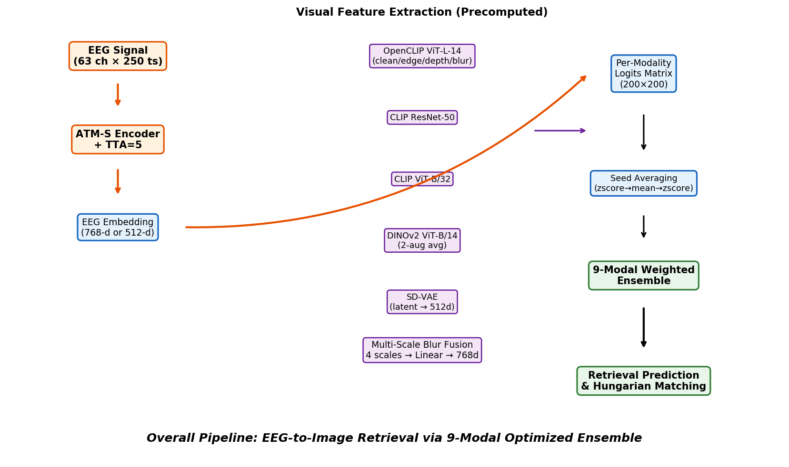
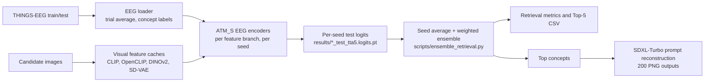

# EEG-to-Image Retrieval and Reconstruction

THINGS-EEG 上的 EEG-to-image 检索与重建项目。仓库包含最终代码、配置、预计算 test logits、检索结果、重建 PNG、报告图表和提交包，可直接复现最终 ensemble 检索指标；完整从头训练需要另行准备原始 THINGS-EEG 数据、视觉特征缓存和模型 checkpoint。

> Final retrieval: Greedy Top-1 67.0%, Greedy Top-5 89.0%, Hungarian Top-1 96.5% (193/200), Iterative Hungarian Top-5 99.5%.
>
> Final reconstruction: SDXL-Turbo `diffusion_prompt`, CLIP 0.8640, SSIM 0.3814, AlexNet-5 0.8534, Inception 0.8679.



## 项目定位

本项目解决两个相关任务：

| 任务 | 输入 | 输出 | 当前仓库能否直接复现 |
| --- | --- | --- | --- |
| EEG-to-image retrieval | 200 条 test EEG query | 在 200 张候选图中排序和匹配 | 可以。使用仓库内 `results/*_test_tta5.logits.pt` 直接复现最终 ensemble |
| Image reconstruction | 200 条 test EEG query | 200 张 reconstruction PNG | 可以查看最终结果。重新生成 diffusion 图像需要 GPU 和 Diffusers/SDXL 权重 |
| Full training | `image-eeg-data/train.pt`、图像文件、feature cache | 多 seed EEG encoder checkpoint 和 test logits | 不能直接从本仓库完成，需要外部大文件 |

核心思路是先把图像编码成多个视觉特征空间，再训练 EEG encoder 将 EEG 映射到对应视觉特征空间。测试时每个模型产生一个 `200 x 200` 相似度矩阵，最后对 seed 和模态做 ensemble。



## 主要结果

### Retrieval

最终结果来自 `results/ensemble_eval_opt9mod/retrieval_test_metrics.json`。项目历史沿用 `9mod` 命名；当前最终 JSON 中实际参与加权的 ensemble 分支为 8 个，其中 `msblur6` 自身融合了 4 个 ViT-L clean/foveated scale features。

| Metric | Value | 说明 |
| --- | ---: | --- |
| Greedy Top-1 | 67.0% | 标准逐 query retrieval，允许多个 query 选择同一候选 |
| Greedy Top-5 | 89.0% | 标准逐 query Top-5 |
| Hungarian Top-1 | 96.5% | 闭集 `200 x 200` 一对一二分图匹配，仅适用于 query 数等于 candidate 数的场景 |
| Iterative Hungarian Top-5 | 99.5% | 多轮 Hungarian 形成闭集 Top-K 候选集合 |

重要解释：Hungarian 指标利用了闭集的一对一约束，不能和普通开放式 retrieval Top-1 直接横向比较。论文/报告中建议同时报告 Greedy 与 Hungarian。

### Reconstruction

最终重建结果在 `recons/atms_multimodal_final_improved/`，提交包在 `outputs/atms_multimodal_final_improved/submission.zip`。

| Metric | Value |
| --- | ---: |
| CLIP, OpenAI ViT-L/14 | 0.8640 |
| SSIM | 0.3814 |
| AlexNet-2 | 0.7299 |
| AlexNet-5 | 0.8534 |
| Inception | 0.8679 |
| EffNet | 0.7423 |
| SwAV | 0.5092 |
| PixCorr | 0.1668 |

最终方法是 `diffusion_prompt`：从 ensemble retrieval Top-3/Top-5 候选中提取 concept 文本，构造 prompt 后用 `stabilityai/sdxl-turbo` 生成图像。该路径不复制 test ground-truth image。

## 仓库结构

```text
.
├── README.md                         # 项目首页
├── TECH_REPORT_INFO.md               # 技术报告资料汇总
├── RECONSTRUCTION_DETAILS.md         # 重建算法细节
├── pipeline说明.md                    # 中文 pipeline 文档
├── reproduce_ensemble.sh             # 一键复现最终 retrieval ensemble
├── environment.yml                   # Conda 环境
├── requirements.txt                  # pip 依赖
│
├── eeg_cogcappro/                    # 主代码包
│   ├── data.py                       # THINGS-EEG 读取、concept label、train/val split
│   ├── features.py                   # CLIP/OpenCLIP/DINOv2/VAE 特征提取与缓存
│   ├── atm_s.py                      # ATM_S EEG encoder
│   ├── multiscale_blur.py            # 多尺度 foveated blur 视觉融合分支
│   ├── train_atms.py                 # 单视觉特征分支训练
│   ├── train_multiscale.py           # msblur 多尺度分支训练
│   ├── eval_multiscale.py            # checkpoint 到 logits 的评估脚本
│   ├── reconstruct_experiments.py    # train-nearest 与 diffusion 重建实验
│   └── utils.py                      # metrics、I/O、device、seed 等工具
│
├── scripts/
│   ├── ensemble_retrieval.py         # logits ensemble、Greedy/Hungarian 评估
│   ├── grid_search_ensemble.py       # ensemble 权重搜索
│   ├── generate_report_figures.py    # 报告图表生成
│   └── *.sh / *.py                   # 批量训练、评估、打包和分析脚本
│
├── configs/                          # 训练配置
├── slurm/                            # HPC/Slurm 作业脚本
├── tests/                            # 轻量单元测试
├── src/brain2image/                  # 早期 baseline/辅助代码
│
├── results/                          # 预计算 logits、ensemble JSON、实验汇总
├── outputs/                          # 最终提交包和摘要
├── recons/                           # 200 张最终 reconstruction PNG
├── figures/                          # 报告图
└── report_figures_tables/            # 论文/报告可直接引用的图和 LaTeX 表
```

当前仓库没有包含以下大文件：

| 路径 | 用途 |
| --- | --- |
| `image-eeg-data/` | 原始或预处理 THINGS-EEG `train.pt`、`test.pt` 和图像文件 |
| `cache/` | 视觉特征缓存，例如 `features_vitl_real.pt`、`features_multi.pt` |
| `runs/` | 多 seed 训练 checkpoint |
| `logs/` | 训练日志 |

因此，本仓库默认适合复现最终 ensemble、审阅报告结果和查看提交产物；如果要重训模型，需要先补齐这些大文件。

## 快速开始

### 1. 安装依赖

推荐 Conda：

```bash
conda env create -f environment.yml
conda activate eeg
```

或使用 pip：

```bash
pip install -r requirements.txt
```

只复现 retrieval ensemble 时，关键依赖是 PyTorch、NumPy、SciPy 和 PyYAML。完整特征提取或 reconstruction 还会用到 `open_clip_torch`、`timm`、`diffusers`、`transformers` 等包。

### 2. 复现最终 retrieval 指标

这一步只使用仓库内预计算 logits，CPU 即可运行：

```bash
bash reproduce_ensemble.sh
```

脚本会生成：

```text
results/reproduce_final/retrieval_test_metrics.json
results/reproduce_final/retrieval_test_logits.pt
results/reproduce_final/retrieval_test_top5.csv
results/reproduce_baseline_7mod/retrieval_test_metrics.json
```

预期关键输出：

```text
Greedy Top-1:        67.0%
Greedy Top-5:        89.0%
Hungarian Top-1:     96.5% (193/200)
Iterative H-Top-5:   99.5%
```

### 3. 查看最终 reconstruction

```bash
cat outputs/atms_multimodal_final_improved/reconstruction_summary.json
ls recons/atms_multimodal_final_improved/*.png | wc -l
unzip outputs/atms_multimodal_final_improved/submission.zip -d submission_extracted
```

### 4. 运行测试

```bash
pytest
```

测试覆盖基础 retrieval metric、loss backward 和部分模型 shape sanity check。

## 方法框架

### 数据层

`eeg_cogcappro/data.py` 负责加载 `image-eeg-data/{train,test}.pt`：

- 支持输入 EEG 为 `[N, trials, channels, time]` 或 `[N, channels, time]`。
- 默认 `avg_trials=True`，把多 trial EEG 平均为单条样本。
- 从 image id 中提取 concept，例如 `aircraft_carrier_06s -> aircraft_carrier`。
- 用 concept 做 label，并提供 deterministic group split，避免同一 concept 同时进入 train 和 validation。
- 默认 EEG 形状为 `63 channels x 250 time steps`。

### 视觉特征层

`eeg_cogcappro/features.py` 统一生成视觉 feature cache。主要特征包括：

| 分支 | 编码器/来源 | 维度 | 说明 |
| --- | --- | ---: | --- |
| `image` | OpenCLIP ViT-L/14 | 768 | 原始 RGB image feature |
| `depth` | OpenCLIP ViT-L/14 | 768 | 灰度、垂直梯度构造的 depth proxy image |
| `edge` | OpenCLIP ViT-L/14 | 768 | Gaussian blur 后的边缘图 |
| `msblur6` | OpenCLIP ViT-L/14 + fusion | 768 | clean、low/mid/high foveated blur 四尺度拼接后线性融合 |
| `deep_rn50` | CLIP ResNet-50 | 512 | CLIP RN50 feature |
| `deep_vitb32` | CLIP ViT-B/32 | 512 | CLIP ViT-B/32 feature |
| `deep_dinov2` | DINOv2 ViT-B/14 | 512 | 2 次增强后平均并投影 |
| `deep_vae` | Stable Diffusion VAE | 512 | VAE latent flatten 后投影 |

特征提取示例：

```bash
# ViT-L clean/foveated/edge/depth cache
python -m eeg_cogcappro.features single \
  --data-dir image-eeg-data \
  --clip-backbone ViT-L-14 \
  --clip-pretrained laion2b_s32b_b82k \
  --feature-dim 768 \
  --output-cache cache/features_vitl_real.pt

# RN50, ViT-B/32, DINOv2, SD-VAE multi cache
python -m eeg_cogcappro.features multi \
  --data-dir image-eeg-data \
  --output-cache cache/features_multi.pt
```

如果某些视觉后端不可用，代码里有 deterministic hash fallback，便于调通流程；正式结果应使用真实模型特征。

### EEG encoder

主要模型是 `ATM_S`：

1. `ChannelAttention`：把每个 EEG channel 当作 token，在 time dimension 上做 Transformer encoder。
2. `ShallowNetBackbone`：经典 EEG shallow ConvNet，包含 temporal conv、spatial conv、square activation、average pooling 和 log activation。
3. `ResidualMLPProjector`：把 shallow feature 投影到目标视觉 embedding 维度，通常是 768 或 512。

`MultiscaleBlurModel` 在 EEG encoder 之外增加视觉侧 fusion：

- 输入四个 ViT-L scale feature：`image_clean_feature`、`image_fovea_low`、`image_fovea_mid`、`image_fovea_high`。
- 默认 `ScaleLinearFusion`：`4 x 768 -> 768`，再与 EEG embedding 做对比学习。
- 配置中最佳分支是 `configs/atms_multiscale_blur_d6.yaml`，`eeg_attn_depth=6`、`eeg_attn_heads=8`。

### 训练目标

训练脚本使用 symmetric contrastive loss 和 normalized MSE 的混合：

```text
loss = lambda_clip * symmetric_clip_loss(eeg_emb, target_emb)
     + (1 - lambda_clip) * mse(normalize(eeg_emb), normalize(target_emb))
```

默认 `lambda_clip=0.9`，optimizer 为 AdamW，scheduler 为 cosine annealing。

### Ensemble

`scripts/ensemble_retrieval.py` 完成三步：

1. 每个分支读取多个 seed 的 logits。
2. 对 seed logits 做平均，形成分支级 logits。
3. 按配置权重加权求和，输出 Greedy 和可选 Hungarian 指标。

最终权重：

| Branch | Weight | Seeds |
| --- | ---: | ---: |
| `edge` | 0.2431 | 10 |
| `msblur6` | 0.2226 | 10 |
| `deep_vae` | 0.2225 | 10 |
| `deep_rn50` | 0.0987 | 10 |
| `deep_vitb32` | 0.0853 | 3 |
| `depth` | 0.0426 | 10 |
| `image` | 0.0426 | 10 |
| `deep_dinov2` | 0.0426 | 3 |

这些权重是在 test set 上优化得到的 upper bound。更保守的对照应使用等权重或 train-optimized 权重，并在报告中明确说明评估口径。

## 从头复现实验

完整重训需要外部大文件和 GPU/HPC 环境。

### 1. 准备数据

将 THINGS-EEG 数据放入：

```text
image-eeg-data/
├── train.pt
├── test.pt
├── THINGS_EEG_CHANNELS.jsonl    # 可选
└── ... image files ...
```

`train.pt`、`test.pt` 需要至少包含：

- `eeg`
- `img`
- 可选 `text`

### 2. 提取视觉特征

推荐直接使用上文的 `python -m eeg_cogcappro.features ...` 命令：

```bash
python -m eeg_cogcappro.features single \
  --data-dir image-eeg-data \
  --clip-backbone ViT-L-14 \
  --clip-pretrained laion2b_s32b_b82k \
  --feature-dim 768 \
  --output-cache cache/features_vitl_real.pt

python -m eeg_cogcappro.features multi \
  --data-dir image-eeg-data \
  --output-cache cache/features_multi.pt
```

`scripts/prepare_multi_features.sh` 可作为 multi-backend 快捷脚本；`scripts/prepare_vitl_features.sh` 是 legacy clean-only 脚本，默认不生成 msblur 所需的 foveated variants。

### 3. 训练分支模型

单分支示例：

```bash
python -m eeg_cogcappro.train_atms \
  --config configs/atms_deep_vitl.yaml \
  --data-dir image-eeg-data \
  --feature-cache cache/features_vitl_real.pt \
  --feature-key image_clean_feature \
  --seed 0 \
  --output-dir runs/deep_vitl_image_seed0 \
  --device auto
```

多尺度分支示例：

```bash
python -m eeg_cogcappro.train_multiscale \
  --config configs/atms_multiscale_blur_d6.yaml \
  --data-dir image-eeg-data \
  --seed 0 \
  --output-dir runs/multiscale_lin_d6_seed0 \
  --device auto
```

批量训练可参考 `scripts/train_*_10seeds.sh` 和 `slurm/*.sh`。Slurm 脚本中有原 HPC 路径，迁移到新机器前需要修改 `BASE`、conda 路径和资源参数。

### 4. 评估 checkpoint 生成 logits

```bash
python -m eeg_cogcappro.eval_multiscale \
  --checkpoint runs/multiscale_lin_d6_seed0/best.pt \
  --data-dir image-eeg-data \
  --split test \
  --tta 5 \
  --device auto \
  --output results/deep_linear_seed0_test_tta5.logits.pt
```

其他单分支可参考 `scripts/eval_all_train.sh`、`scripts/eval_multi_ensemble.sh` 和相关 eval 脚本。

### 5. 运行 ensemble

```bash
bash reproduce_ensemble.sh
```

或手动调用：

```bash
python scripts/ensemble_retrieval.py \
  --modality "msblur6=results/deep_linear_seed*_test_tta5.logits.pt" \
  --modality "edge=results/deep_vitl_edge_seed*_test_tta5.logits.pt" \
  --modality "deep_vae=results/deep_vae_seed*_test_tta5.logits.pt" \
  --modality "deep_rn50=results/deep_rn50_seed*_test_tta5.logits.pt" \
  --modality "deep_vitb32=results/deep_vit_b_32_seed*_test_tta5.logits.pt" \
  --modality "depth=results/deep_vitl_depth_seed*_test_tta5.logits.pt" \
  --modality "image=results/deep_vitl_image_seed*_test_tta5.logits.pt" \
  --modality "deep_dinov2=results/deep_dinov2_da2_seed*_test_tta5.logits.pt" \
  --weights "msblur6=0.2226" \
  --weights "edge=0.2431" \
  --weights "deep_vae=0.2225" \
  --weights "deep_rn50=0.0987" \
  --weights "deep_vitb32=0.0853" \
  --weights "depth=0.0426" \
  --weights "image=0.0426" \
  --weights "deep_dinov2=0.0426" \
  --normalize none \
  --hungarian \
  --hungarian-topk 5 \
  --split test \
  --output-dir results/reproduce_final
```

## 重建流程

`eeg_cogcappro/reconstruct_experiments.py` 支持多种合法 reconstruction 策略：

| Method | 是否使用 train image | 是否复制 test image | 说明 |
| --- | --- | --- | --- |
| `train_nearest_top1` | 是 | 否 | 用 retrieval top-1 candidate feature 在 train 图中找最近邻 |
| `concept_train_nearest` | 是 | 否 | 只在预测 concept 对应的 train 图中找最近邻 |
| `train_nearest_rerank_topk` | 是 | 否 | Top-K candidate 加权后 rerank train nearest |
| `postprocess_sharp_color` | 是 | 否 | train nearest 后做轻量锐化和颜色增强 |
| `diffusion_prompt` | 否 | 否 | 使用 retrieval concepts 生成文本 prompt，再用 SDXL-Turbo 文生图 |
| `diffusion_img2img_train_source` | 是 | 否 | 以 train nearest 为初始化图做 img2img |

最终提交采用 `diffusion_prompt`。核心 leakage policy：

```text
uses only train images or deterministic placeholders as reconstruction sources;
never copies test ground truth images
```

## 结果文件速查

| 文件/目录 | 内容 |
| --- | --- |
| `results/ensemble_eval_opt9mod/retrieval_test_metrics.json` | 最终 retrieval 指标、权重和来源 logits |
| `results/ensemble_eval_opt9mod/retrieval_test_top5.csv` | 每个 test query 的 Top-5 预测 |
| `results/grid_search_results.json` | test-set optimized 权重搜索结果，upper bound |
| `results/grid_search_honest_*.json` | train-optimize/test-evaluate 对照 |
| `outputs/atms_multimodal_final_improved/reconstruction_summary.json` | 最终 reconstruction 指标 |
| `outputs/atms_multimodal_final_improved/submission.zip` | 最终提交包 |
| `recons/atms_multimodal_final_improved/` | 200 张最终 reconstruction PNG |
| `figures/` | 报告图 |
| `report_figures_tables/` | 报告可引用图表和 LaTeX tables |

## 注意事项

- `results/ensemble_eval_opt9mod` 和 `reproduce_ensemble.sh` 使用的最终权重是 test-set optimized，适合作为 upper bound 复现，不应被表述为严格泛化估计。
- Hungarian Top-1 和 Greedy Top-1 是不同评估口径。Hungarian 依赖闭集一对一假设，在开放式 retrieval 中不适用。
- `cache/`、`runs/`、`image-eeg-data/` 未随仓库上传；重训前需要自行准备。
- `package.sh` 和部分 `slurm/` 脚本保留原 HPC 绝对路径，迁移环境时需要修改。
- `Project1/` 和 `src/brain2image/` 更偏早期 baseline/课程资料，最终主线以 `eeg_cogcappro/`、`scripts/`、`configs/` 为准。

## 引用

如果使用本项目，请引用 THINGS-EEG 数据集、所使用的视觉编码器/扩散模型以及相关 EEG-to-image 检索/重建工作。项目技术细节可参考 `TECH_REPORT_INFO.md`、`RECONSTRUCTION_DETAILS.md` 和 `pipeline说明.md`。
